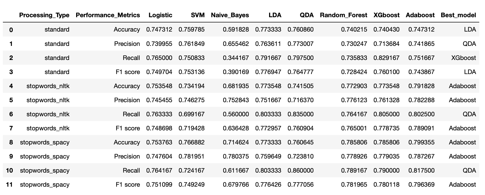
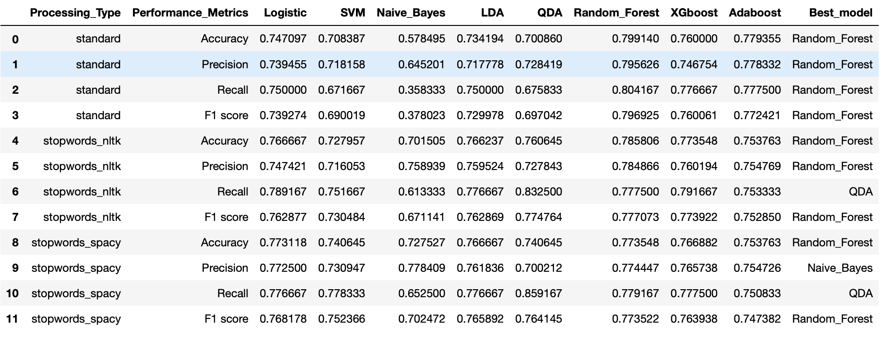
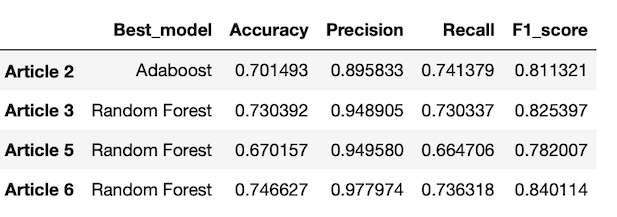

# Predicting Judicial Decisions of the European Court of Human Rights (ECHR)


## Project Overview


- Developed a classifier to predict whether a particular Article of the European Convention on Human Rights has been violated, given textual evidence extracted from a case.


- Parsed and collected case information and judgement document for each ECHR case from HUDOC(Human Rights Documentation) API using Python.


- Preprocessed judgement documents to generate text data and sorted them by the revelant Article. 


- Extracted features from the text data using pre-trained word embedding models.


- Optimised and compared machine learning classification models built on different feature matrix by varing hyperparameters not only in machine learning models but also preprocessing methods, etc. 

## Code and Resources Used

**Packages:** pandas, numpy, sklearn, xgboost, selenium, json, os, sqlalchemy, psycopg2, nltk, scipy, gensim, requests, doxc, re, zipfile, ast 

**Legal Text Classification Framework**

- Aletras N, Tsarapatsanis D, Preoţiuc-Pietro D, Lampos V (2016) Predicting judicial decisions of the European Court of Human Rights: a natural language processing perspective. PeerJ Comput Sci 2:e93.

**HUDOC Data Collection** 

- HUDOC database : https://hudoc.echr.coe.int/eng#{"documentcollectionid2":["GRANDCHAMBER","CHAMBER"]}

- Quemy, A. (2018), ‘European court of human right open data project’, arXiv preprint arXiv:1810.03115.

**Word Embedding**

- GloVe : https://nlp.stanford.edu/projects/glove/

- Pennington, J., Socher, R., and Manning, C. D. (2014). Glove: Global vectors for word representation. Proceedings of the 2014 Conference on Empiricial Methods in Natural Language Processing (EMNLP-2014).

- Law2Vec : https://archive.org/details/Law2Vec

**Random Search**

https://web.archive.org/web/20160701182750/http://blog.dato.com/how-to-evaluate-machine-learning-models-part-4-hyperparameter-tuning

## Dataset Generation Process


The datasets based on the raw information and documents available publicaly in HUDOC database.

### 1. Retrieving case information from HUDOC database

- Retriedved information about ECHR cases available from HUDOC API and saved in JSON files. 

- Filtered case information to keep only the cases in English, with an attached judgement documents(MS Word), and with a clear conclusion.

- Cleaned case information by parsing and formatting so that it can be more easily accessible. 

- Sorted case information by Article with at least 100 associated cases.

- Converted case information JSON files to Pandas DataFrames and stored in PostgreSQL database. 

### 2. Getting judgement documents from HUDOC database

- Downloaded the judgement documents in MS Word format using HUDOC API and case id retrieved from case information.

### 3. Parsing judgement documents 

- Parsed judgement documents to extract text from only relevant part of judgement documents by removing THE LAW and conclusion part. 

    - THE LAW part was removed since it includes arguments and discussions of judges that contain the information about the final case outcome. 

    - The conclusion part was removed in order to avoid data leakage as it contains information about the target variable (i.e, violation or no violation). 


### 4.  Generating dataset

- Created dataset using the text data extracted from the previous step for each Article.  

    - Each row represents a legal case from ECHR.
    - The columns are case id(i.e, Itemid), judgement text, and judicial decision(Judgement).
    - Any cases that were missing judgement text were marked as 'unavailable'.
    
    
- Combined datasets from each Article into one dataframe to be stored in a PostgresSQL database.

## Text Preprocessing 

There are 3 variations of the text obtained from varying stop words treatement. 
Following text preprocessing steps were applied:

- Lowercasing

- Removing numbers, special characters & punctuations

- Word tokenisation


- Stop words 

    - No stopwords treatement; referred to 'standard'
    - Remove stop words using NLTK stop words list
    - Remove stop words using SpaCy stop words list
    

## Feature Engineering 


Pre-trained **GloVe** word embedding models were used to extract features from the text. A word embedding is a learned representation for text in an n-dimensional space where words that have the same meaning have a similar representation. In this project, this particular NLP method was employed in order to 

- transform textual data into numerical vectors.

- capture the semantics of the words in the text dataset.

Each judgement text was represented by the average of the word embedding vectors of the words that compose the text.

The process of converting text to an average of word embedding vectors is as follows: 

For each preprocessed judgement text in the dataset, 
1. replaced each word by a vector representation of the word.

2. averaged all these vectors to produce the vector representation of the judgement text from a case in the dataset. 

#### Dimensions of GloVe Word Embedding

Both 100 and 200 dimension of GloVe word embeddings were considered. 

## Model Building & Evaluation


### Train-Test Split Method and Evaluation Metrics 

Correctly identifying both violation and no-violation cases are equally important, therefore, **accuracy** was selected to evaluate the model. However, it was found that there are far more violation cases than no-violation cases for each Article. With the high imbalance in the number of cases per class, many machine learning models are subject to a frequency bias in which they place more emphasis on learning from data observations which occur more commonly. Thus, the models are likely to just learn the distribution of class and simply predict the majority class for every unseen case. In such a case, accuracy do not adequately represent performance as the accuracy is only reflecting the underlying class distribution. 

In order to tackle this issue, undersampling was performed to reduce the number of violation cases in training set as follows:

- Select 10% of no-violation cases for a test set and the rest for a training set. 

- Using the number of no-violation cases in the test set, choose the number of violation cases for the test set so that the ratio of each class in the original dataset is maintained in the test set. 

- Using the number of violation cases in the training set, choose the same number of violation cases for the training set for a balanced training set. 

### Machine Learning Classification Models

The models that were considered:

- Logistic Regression 

- SVM

- Naive Bayes

- Linear Discriminant Analysis

- Qudratic Discrimant Analysis

- Random Forest

- Gradient Boosted Trees (XGBoost)

- Ada Boost


### Variations Resulting in Different Feature Matrices

Following variations were considered

- preprocessing the text (3 versions of judgement text)

- dimensions of GloVe word embedding (2 versions)

for experimentation. These variations affected the learning process by resulting in a different feature matrix. Every combination of these variations were used and compared to find the optimal model just like finding the best parameters in grid search. 


### Hyperparameter Tuning with Random Search 

Random search was performed to find the optimal set of hyperparameters as it seems more feasible method when there are many hyperparameters to tune. 

For a given Article, each version of text, and each dimensional word vectors, following steps were applied to find the optimal model: 

- For each classification models, 

    1. convert the text data into an average vector using a customised vectoriser. 

    2. scale the feature matrix using Min-Max scaler to normalise them.

    3. select random combinations from a grid of hyperparameter values and train the model using 5-fold cross-validation. Find the optimal set of paramter which gives the highest accuracy. 

    4. refit the model with the best found parameters on the whole training set and store the parameter values and scores. 
    

- Compare the performance of models and find the best model.

    - i.e, Article 2 model performance table 
    
        - 100-dimensional
        
         
        
        - 200-dimensional
        
        


- Make predictions on test set using the best model.


## Model Performance





```python

```
